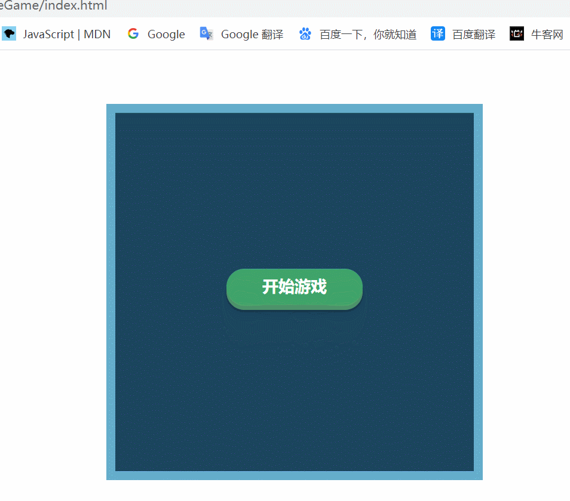

# JavaScript实现贪吃蛇游戏

用javascript实现的贪吃蛇小游戏


### 1. 主要功能

- 点击按钮开始游戏、暂停游戏、继续游戏
- 撞墙、撞到蛇身结束游戏并显示得分
- 使用键盘方向键控制蛇身移动
- 蛇头吃到食物，蛇身长度加一
- 食物随机显示


### 2.主要逻辑

- 画布：400 * 400 ，方块：16 * 16，列 * 行：25 * 25

- 通过坐标（x, y）创建蛇身方块

- 方块采取绝对定位：坐标（1，2）表示 left: 16px,  top: 32px

- 使用双向链表结构存储蛇的身体，让蛇成为一个整体进行移动（而不是一个个的小方块）

- 蛇的移动逻辑

  - 只需要移动蛇头和蛇尾方块
  - **head移动一格(删除再添加)，添加一个新的小方块占据原来head的位置；如果只是移动，没有吃到食物，就改变tail指针，使tail指针指向前面一格，原来的tail就删去；如果吃到了食物就不改变tail**
  - 为什么要双向链表
    - `this.tail = this.tail.prev;`
    - **删除尾节点，改变tail指针指向时，就很容易通过tail.prev找到前一个节点**

- 游戏运行逻辑

  - 通过监听键盘事件，获取移动方向

  - 游戏能进行，是因为设置了一个定时器，定时获取蛇移动的下一个位置信息（4种情况）

    根据情况进行下一步操作：

    - 如果是div#snakeWrap的边界，游戏结束
    - 如果碰到的是蛇自身的身体，游戏结束
    - 如果是食物，蛇的身体的长度加一
    - 如果以上都不是，则继续移动

  - 暂停游戏：清除定时器，并展示暂停游戏按钮的DOM

  - 结束游戏，需要清除定时器，清除数据（重新实例化）


### 3. 实现效果




### 4. 主要代码

- 创建Snake

```js
// 创建蛇snake -- 双向链表
class Snake {
  constructor() {
    this.head = null; // 蛇头
    this.tail = null; // 蛇尾
    this.pos = []; // 存储蛇身体的每一个小方块的位置坐标(x,y)

    // 存储蛇走的方向 -- 蛇头坐标(x,y)
    this.directionNum = {
      // 往左边走 x - 1, 往右边走 x + 1, 往上边走 y - 1, 往下边走 y + 1
      left: {
        x: -1,
        y: 0,
        // 以向右走为默认情况，则向左走时，蛇头应该旋转180度
        rotate: 180
      },
      right: {
        x: 1,
        y: 0,
        rotate: 0
      },
      up: {
        x: 0,
        y: -1,
        rotate: -90
      },
      down: {
        x: 0,
        y: 1,
        rotate: 90
      }
    }
  }

  // 蛇的初始化 -- 默认一开始蛇由一个蛇头小圆块和2个蛇身小方块组成
  init() {
    // 创建蛇头并保存相应信息
    let snakeHead = new Square(2, 0, 'snake-head');
    snakeHead.create();
    this.head = snakeHead;
    this.pos.push([2, 0]);

    // 创建蛇身并保存相应信息
    let snakeBody1 = createSnakeBody(1, 0);
    this.pos.push([1, 0]);

    let snakeBody2 = createSnakeBody(0, 0);
    this.tail = snakeBody2;
    this.pos.push([0, 0]);

    // 形成双向链表结构, 便于蛇进行移动时是一个整体
    snakeHead.next = snakeBody1;
    snakeBody1.prev = snakeHead;
    snakeBody1.next = snakeBody2;
    snakeBody2.prev = snakeBody1;

    // 设置默认蛇移动的方向
    this.direction = this.directionNum.right;
  }

  // 获取蛇头的下一个位置对应的元素 (不同元素做不同的事情)
  getNextPos() {
    // 计算下一个位置的坐标
    let nextPos = [(this.head.x / sw + this.direction.x), (this.head.y / sh + this.direction.y)];

    // 根据坐标对应元素的不同做不同的事情
    // - 如果是div#snakeWrap的边界，游戏结束
    if (nextPos[0] < 0 || nextPos[1] < 0 || nextPos[0] > td - 1 || nextPos[1] > tr - 1) {
      // console.log("撞墙了！");
      return this.strategies.gameover.call(this);
    }

    // - 如果碰到的是蛇自身的身体，游戏结束
    // 遍历蛇身位置数组，如果能找到相同值，则说明下一个位置撞到了蛇自身
    let result = this.pos.find(item => (item[0] === nextPos[0] && item[1] === nextPos[1]));
    if (result) {
      // console.log("撞到自己了！")
      return this.strategies.gameover.call(this);
    }

    // - 如果是食物，蛇的身体的长度加一
    // 判断下个位置的坐标和食物的坐标是否相同
    if (food && food.pos[0] === nextPos[0] && food.pos[1] === nextPos[1]) {
      // console.log("吃到食物了")
      return this.strategies.eat.call(this);
    }

    // - 如果以上都不是，则继续移动
    // 调用call方法，改变strategies对象的this指向(即：对象本身)，使其this指向call中传递的this(即：snake实例)
    return this.strategies.move.call(this);
  }

  // 处理蛇身移动到下一步之后要做的事情
  strategies = {
    // this指向对象strategies, 就意味着不能通过this获取到snake的实例的属性和方法
    // 所以调用该对象的方法时需要使用call(this)方法，改变this指向
    // 继续移动
    move(format = false) { // format参数用于判断贪吃蛇是否吃到食物(吃到食物不需要删), 默认为false
      // 由于是双向链表结构，所以并不需要把蛇的所有小方块都移动而是只需要移动蛇的身体和蛇的尾部
      // 即：head移动一格(删除再添加)，添加一个新的小方块占据原来head的位置，tail指针指向前面一格，原来的tail就删去

      // 创建新的身体, newBody的位置就是原来Head的位置
      let newBody = createSnakeBody((this.head.x / sw), (this.head.y / sh))
      // 更新链表的关系
      newBody.next = this.head.next;
      newBody.next.prev = newBody
      this.head.remove(); // 移除head(只是从DOM中移除了并没有从内存中移除)

      // 创建新蛇头 , 新蛇头的位置就是nextpos的位置
      const x = this.head.x / sw + this.direction.x;
      const y = this.head.y / sh + this.direction.y;
      let newSnakeHead = new Square(x, y, 'snake-head');
      // 更新链表关系
      this.head = newSnakeHead;
      newBody.prev = newSnakeHead;
      newSnakeHead.next = newBody;
      // 在创建蛇头时旋转蛇头的方向
      newSnakeHead.viewContent.style.transform = `rotate(${this.direction.rotate}deg)`
      newSnakeHead.create();

      // 蛇身的每一个方块的坐标也需要更新
      // newBody的坐标就是原来head的坐标，需要在数组头部添加新的head的坐标
      this.pos.unshift([x, y]);

      // 不是所有情况都需要删，吃到食物就不需要删
      // 如果format为false就说明没有吃到食物就需要删除蛇尾元素，需要进行删除
      if (!format) {
        // 删除tail所在的小方块并移动tail指针 --- 为什么要双向链表的原因了
        this.tail.remove();
        this.tail = this.tail.prev;

        // 原数组的最后一个元素是原来的tail的位置信息，需要从数组中删除
        this.pos.pop();
      }
    },

    // 吃到食物，蛇的体长加1
    eat() {
      this.strategies.move.call(this, true);
      // 吃到了食物之和再重新生成食物 (改变食物的坐标)
      createFood();
      // 吃到食物之后得分+1
      snakeGame.score++;
    },

    // 碰到边界和蛇身，游戏结束
    gameover() {
      snakeGame.over();
    }
  }
}
```

- 创建食物

```js
// 创建食物
function createFood() {
  // 食物小方块的随机坐标
  let x, y;

  // 循环跳出的条件, true表示随机生成的食物的坐标在蛇身上需要继续循环，false表示食物坐标不在蛇身上不用再循环了
  let include = true;

  while (include) {
    // 生成最小为0, 最大为24的随机数
    x = Math.round(Math.random() * (td - 1));
    y = Math.round(Math.random() * (tr - 1));

    // find找到返回满足条件的第一个元素，没找到返回undefined
    include = snake.pos.find(item => (item[0] === x && item[1] === y))
  }

  // 根据坐标生成食物
  food = new Square(x, y, 'food');
  food.pos = [x, y]; // 保存食物的坐标

  // 通过改变食物的坐标实现吃到食物后食物的消失与创建(如果有食物了就改变坐标, 没有就创建食物)
  let foodDom = document.querySelector('.food');
  if (foodDom) {
    foodDom.style.left = `${x*sw}px`;
    foodDom.style.top = `${y*sh}px`;
  } else {
    food.create();
  }
}
```


# javascript-snake-game
